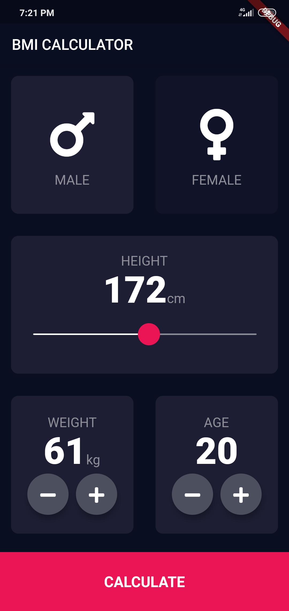
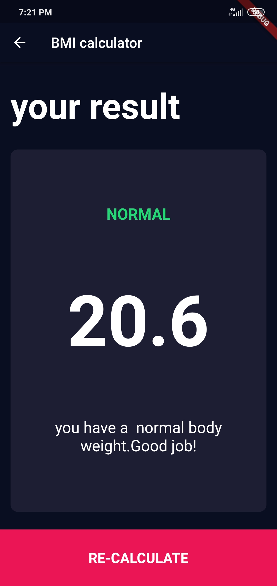

# Flutter-apps
this app are made by flutter

# BMI calculator 

this is bmi calculator which will calculate our heathy ratio according to weight and height.
here we give input of height using slide and weight using given buttons  and we have formula in another file which will calculate 
and print result in new page.

note: here we use custome widget means we modified or make full widget according to our reqirement ex,
1.we add 2 floating action button but we can't add more than 1 so we modified that widget and make new widhet add 2 buttons 2 time
2.Usiing reusable card we create our own card instead of using predefine card widget
3.fonts are also downloaded , and we make button tappable making  that are sensibae for touch , etc.

# screen shots
,
